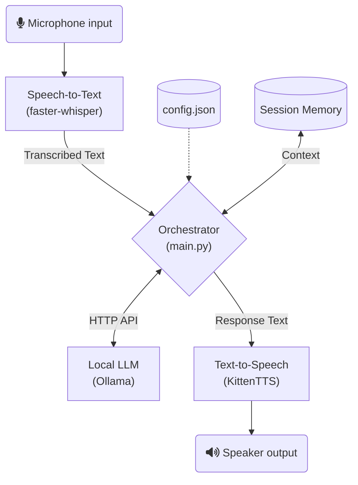

# Architecture Overview

Pocket Companion is designed to be fully modular and local, consisting of three primary inferencing engines orchestrated by a central controller.

## Core Flow Diagram

## Module Responsibilities

1. **Speech-to-Text (STT):** Listens via `sounddevice` using a Voice Activity Detection (VAD) threshold. Once silence is detected, the recorded numpy array is evaluated by the `base.en` Whisper model.
2. **Orchestrator:** Parses the text for system commands (e.g. "stop listening"). If it's a conversational input, it retrieves chat history from `memory.json`, prepends the system prompt, and queries the LLM.
3. **Large Language Model (LLM):** Handled externally by Ollama. Provides rapid response generation, specifically tuned for short, conversational answers.
4. **Text-to-Speech (TTS):** Uses KittenTTS to synthesize the incoming text into a specified voice persona, played natively via `sounddevice`.

## Execution Environment
All execution runs entirely on the host machine. No external internet calls are made past the initial model downloading phase.
